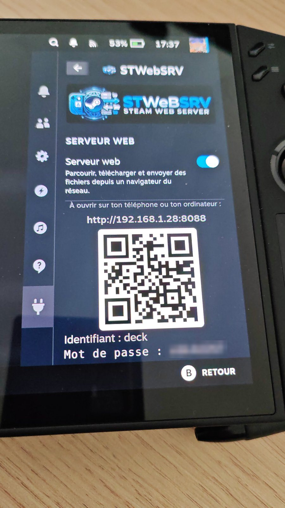
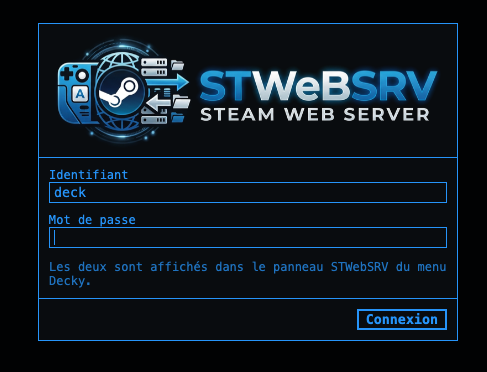
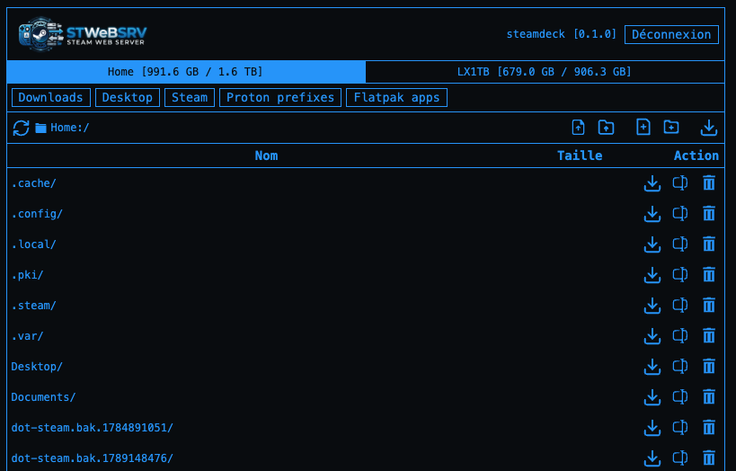
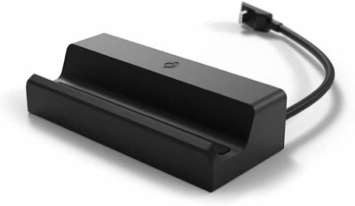
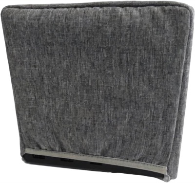

<p align="center"></p>

# STWebSRV — Steam Web Server

Plugin **[Decky Loader](https://decky.xyz/)** pour **SteamOS** (Steam Deck, Lenovo Legion Go S / Go 2, Steam Machine…). Un interrupteur dans le menu d'accès rapide lance un **gestionnaire de fichiers web** sur la console : depuis le navigateur de ton téléphone ou de ton ordinateur, tu parcours, télécharges, envoies, renommes, supprimes et modifies les fichiers de la console, sans passer en mode bureau ni installer de client SFTP.

La page web est adaptée de la **WebUI du firmware [Bruce](https://github.com/BruceDevices/firmware)** (LilyGO, M5Stack…), dont elle garde l'apparence et l'éditeur.

## 📸 Aperçu

<p align="center"></p>

<p align="center"><em>Le panneau Decky sur une Lenovo Legion Go 2 (SteamOS) : on active le serveur, on scanne le QR code.</em></p>

<p align="center">
  
  &nbsp;
  
</p>

<p align="center"><em>La page de connexion et l'explorateur, ouverts depuis un ordinateur du réseau.</em></p>

## ✨ Fonctions

### Dans le menu Decky

- **Serveur web à la demande** : un interrupteur pour le démarrer ou l'arrêter.
- **Adresse et QR code** : l'adresse à ouvrir (`http://<ip-de-la-console>:8088`) et un QR code à scanner avec le téléphone. Si le port 8088 est pris, le serveur prend le suivant libre.
- **Plusieurs réseaux** (câble + Wi-Fi, dock USB…) : le serveur répond sur tous. Chaque adresse est affichée avec son type (Câble, Wi-Fi, Autre), **le câble passe en premier**, et le menu « Adresse affichée » (à partir de la 0.2.0-beta.2) permet de choisir celle du QR code. Le choix est retenu ; si la carte choisie est débranchée, l'ordre automatique reprend.
- **Identifiant et mot de passe** affichés dans le panneau : `deck` et un mot de passe aléatoire de 8 caractères, créé à la première utilisation et conservé ensuite.
- **Changement de mot de passe** : le bouton « Nouveau mot de passe » en génère un autre et **déconnecte immédiatement toutes les sessions ouvertes**.
- **Visiteurs récents** : les adresses IP connectées dans les 5 dernières minutes.
- **Arrêt automatique** : après 5, 15, 30 ou 60 minutes sans activité (15 par défaut), ou jamais. Un transfert en cours compte comme de l'activité. Une notification prévient de l'arrêt.
- **Thème de la page web** au choix : **Steam** (bleu, par défaut), **Bruce** (rose, les couleurs d'origine) ou **Hacker** (vert).
- **Notifications** désactivables.

### Dans le navigateur

- **Page de connexion** avec le logo, identifiant prérempli.
- **Disques** : le dossier personnel, et chaque **carte SD ou clé USB** montée, avec l'espace utilisé et la capacité.
- **Raccourcis** vers les dossiers utiles de SteamOS, affichés seulement s'ils existent : Téléchargements, Bureau, ROMs et BIOS (EmuDeck), Steam, préfixes Proton, applis Flatpak.
- **Fil d'Ariane cliquable** et bouton d'actualisation ; l'adresse de la page suit le dossier ouvert (retour arrière du navigateur, favoris).
- **Envoi** de fichiers ou d'un **dossier entier avec son arborescence**, par bouton ou **glisser-déposer**, **sans limite de taille**. Confirmation avant de remplacer un fichier existant.
- **Envoi reprenable et vérifié** (à partir de la 0.2.0-beta.3) : le fichier part en morceaux de 8 Mo, chacun contrôlé par CRC32 et renvoyé s'il arrive abîmé. En cas de coupure réseau, l'envoi réessaie tout seul ; si tu fermes la page, renvoyer le même fichier reprend là où il s'était arrêté (après vérification de la partie déjà reçue). Le fichier ne prend son vrai nom qu'une fois complet et son empreinte vérifiée : un fichier existant n'est jamais abîmé. La place libre est contrôlée avant de commencer, et les envois abandonnés sont effacés au bout de 24 h.
- **Suivi du transfert** : pour chaque fichier et pour l'ensemble, quantité envoyée / totale, pourcentage, **débit** et **temps restant** ; bouton **Annuler**.
- **Téléchargement** d'un fichier (reprise possible grâce aux requêtes partielles) ou d'un **dossier entier en .zip**, fabriqué à la volée.
- **Éditeur de texte** intégré, repris de Bruce : numéros de ligne, indentation avec Tab / Maj+Tab, fermeture automatique des parenthèses et guillemets, commentaires avec Ctrl+/ ou Ctrl+#, **enregistrement avec Ctrl+S**, alerte si on ferme sans enregistrer. Idéal pour les fichiers de configuration (`.ini`, `.cfg`, `.json`, `.conf`…).
- **Aperçu** des images, vidéos et fichiers audio dans la page.
- **Renommer, supprimer** (avec confirmation), **créer un fichier ou un dossier**.
- 🧪 **Ajouter à Steam** (bêta, à partir de la 0.2.0-beta.1) : un bouton ▶ sur les programmes (`.exe`, `.bat`, `.msi`, `.sh`, `.AppImage`…) crée un **raccourci « jeu non-Steam »** dans la bibliothèque, sans redémarrer Steam. Nom modifiable, **Proton activé d'office pour les programmes Windows** (Proton Experimental s'il est installé, sinon le Proton le plus récent), options de lancement facultatives, rendu exécutable si besoin pour les programmes Linux. Si le fichier est déjà dans Steam, la page demande confirmation avant de créer un doublon. Une notification s'affiche sur la console ; un appui ouvre la fiche du jeu.
- Page **utilisable sur téléphone** et sur ordinateur.
- **Français ou anglais**, selon la langue du navigateur (et celle de Steam pour le panneau).

### Mises à jour

- Vérification **automatique une fois par jour** sur GitHub, et bouton **Vérifier les mises à jour**.
- **Installation en un clic** depuis le panneau, avec vérification de l'empreinte SHA-256 par Decky.
- **Canal bêta** optionnel pour recevoir les versions de test en avance, et **retour à la version stable** en un clic.

## 📥 Installation

Prérequis : une console sous SteamOS avec [Decky Loader](https://decky.xyz/) installé.

### Depuis la console, par URL (le plus simple)

1. Decky → ⚙️ Paramètres → Général → activer le **Mode développeur**.
2. Decky → ⚙️ → **Développeur** → **Installer un plugin depuis une URL**, puis coller :
   ```
   https://github.com/koua29/decky-stwebsrv/releases/latest/download/STWebSRV.zip
   ```
3. Valider : **STWebSRV** apparaît dans la liste des plugins Decky.

### Avec le fichier ZIP

Télécharger `STWebSRV.zip` depuis la page [Releases](https://github.com/koua29/decky-stwebsrv/releases), puis Decky → ⚙️ → Développeur → **Installer un plugin depuis un fichier ZIP**.

## 🚀 Utilisation

1. Ouvre **STWebSRV** dans le menu Decky et active **Serveur web**.
2. Scanne le QR code avec ton téléphone, ou tape l'adresse affichée (par exemple `http://192.168.1.20:8088`) dans un navigateur connecté au **même réseau**.
3. Connecte-toi avec l'identifiant et le mot de passe affichés dans le panneau.
4. Quand tu as fini, désactive le serveur (ou laisse l'arrêt automatique s'en charger).

## 🔒 Sécurité

- Le serveur ne tourne **que quand tu l'actives**, et s'arrête tout seul après la durée d'inactivité choisie ou quand le plugin se décharge.
- Il tourne avec les droits de l'utilisateur de la console (`deck`), **jamais en root** : les fichiers système restent inaccessibles.
- Chaque chemin est vérifié côté serveur : **impossible de sortir du disque choisi**, même par un lien symbolique. Supprimer ou renommer un lien agit sur le lien, jamais sur sa cible.
- **Protection contre les essais de mot de passe** : après 5 erreurs, la connexion est bloquée 30 secondes, et chaque échec est ralenti.
- Les modifications exigent la session (cookie `HttpOnly`, `SameSite=Strict`) et un en-tête propre à la page, ce qui bloque les requêtes forgées depuis un autre site. Les fichiers ouverts dans le navigateur sont servis dans un bac à sable (un fichier HTML envoyé ne peut rien exécuter).
- **Ajouter à Steam** ne lance rien : il crée seulement le raccourci, que tu démarres toi-même depuis la bibliothèque. Il ne fonctionne qu'en mode Jeu, avec Decky actif.
- Le mot de passe est rangé dans `~/homebrew/settings/STWebSRV/settings.json`, lisible par le seul utilisateur.
- La connexion est en **HTTP simple** sur le réseau local, comme la WebUI de Bruce : n'active le serveur que sur un réseau de confiance (ton Wi-Fi à la maison, pas celui d'un hôtel).

## 🔄 Mises à jour

STWebSRV vérifie une fois par jour s'il existe une nouvelle version sur GitHub. Si c'est le cas, une notification s'affiche et le panneau propose **Mettre à jour** : Decky ouvre sa fenêtre de confirmation habituelle, vérifie l'empreinte SHA-256 du zip, puis recharge le plugin. Les réglages (dont le mot de passe) sont rangés hors du dossier du plugin, dans `~/homebrew/settings/STWebSRV/`, et ne sont pas touchés.

Tu peux aussi vérifier à la main (**Vérifier les mises à jour**, en bas du panneau), ou réinstaller par l'URL ci-dessus, qui pointe toujours vers la dernière version stable.

Chaque version est publiée dans les [Releases](https://github.com/koua29/decky-stwebsrv/releases) avec un tag `vX.Y.Z` et la liste des nouveautés.

### Versions bêta

Options → **Versions bêta** fait aussi regarder les versions de test (tags `vX.Y.Z-beta.N`, publiées en *pre-release* sur GitHub). Elles arrivent plus tôt et peuvent être instables ; sans cette option, STWebSRV ne propose que les versions stables. Une bêta installée active l'option d'elle-même.

En repassant l'option sur off alors qu'une bêta est installée, le panneau propose de **revenir à la dernière version stable**.

**Statut** : projet jeune (0.x). En cas de souci, les journaux sont dans `~/homebrew/logs/STWebSRV/` : ouvre une [issue](https://github.com/koua29/decky-stwebsrv/issues) avec leur contenu.

## 🛠️ Développement

```bash
npm install
./package.sh
```

`package.sh` compile le panneau et produit `out/STWebSRV.zip` : un dossier `STWebSRV/` avec `dist/`, `web/`, `main.py`, `plugin.json`, `package.json`, `LICENSE` et `README.md`.

- `main.py` : serveur HTTP (bibliothèque standard Python, dans un thread), sessions, opérations sur les fichiers, vérification des mises à jour.
- `web/` : la page web (HTML, CSS, JavaScript sans dépendance).
- `src/` : le panneau Decky (React), avec le QR code généré par [qrcode-generator](https://github.com/kazuhikoarase/qrcode-generator) (MIT).

## 🎮 Accessoires SteamOS

*Liens partenaires Amazon : si vous achetez via ces liens, le projet touche une petite commission, sans surcoût pour vous. Des accessoires pour les machines SteamOS sur lesquelles STWebSRV s'installe.*

<table>
<tr>
<td align="center" width="33%">
  <a href="https://www.amazon.fr/dp/B0C349WPZG?linkCode=ll2&amp;tag=koua29-21&amp;ref_=as_li_ss_tl"></a><br>
  <b><a href="https://www.amazon.fr/dp/B0C349WPZG?linkCode=ll2&amp;tag=koua29-21&amp;ref_=as_li_ss_tl">Steam Deck Docking Station</a></b><br><sub>Le dock officiel de Valve : écran, réseau filaire, USB</sub>
</td>
<td align="center" width="33%">
  <a href="https://www.amazon.fr/dp/B0HG8VBXSK?linkCode=ll2&amp;tag=koua29-21&amp;ref_=as_li_ss_tl"></a><br>
  <b><a href="https://www.amazon.fr/dp/B0HG8VBXSK?linkCode=ll2&amp;tag=koua29-21&amp;ref_=as_li_ss_tl">Housse Steam Machine</a></b><br><sub>Protège la Steam Machine de la poussière</sub>
</td>
<td align="center" width="33%">
  <a href="https://www.amazon.fr/dp/B0H2JS25Y3?linkCode=ll2&amp;tag=koua29-21&amp;ref_=as_li_ss_tl"></a><br>
  <b><a href="https://www.amazon.fr/dp/B0H2JS25Y3?linkCode=ll2&amp;tag=koua29-21&amp;ref_=as_li_ss_tl">Steam Controller</a></b><br><sub>La manette de Valve, pour PC, Steam Deck et Steam Machine</sub>
</td>
</tr>
</table>

<sub>En tant que Partenaire Amazon, je réalise un bénéfice sur les achats remplissant les conditions requises. · As an Amazon Associate I earn from qualifying purchases.</sub>

## ☕ Offrez-moi un café

Ce projet est gratuit et open source. S'il vous est utile, vous pouvez me remercier
en m'offrant un café — il suffit de scanner ce QR code PayPal. Merci beaucoup ! 🙏

<p align="center">
  
</p>

## 📜 Licence et crédits

**AGPL-3.0** — voir [LICENSE](LICENSE). La page web reprend le code de la WebUI de [Bruce](https://github.com/BruceDevices/firmware) (AGPL-3.0, interface web de [lshaf](https://github.com/lshaf)) : merci à eux.

Projet non officiel, non affilié à Valve ni à Lenovo. Steam, SteamOS, Steam Deck et Steam Machine sont des marques de Valve Corporation.
